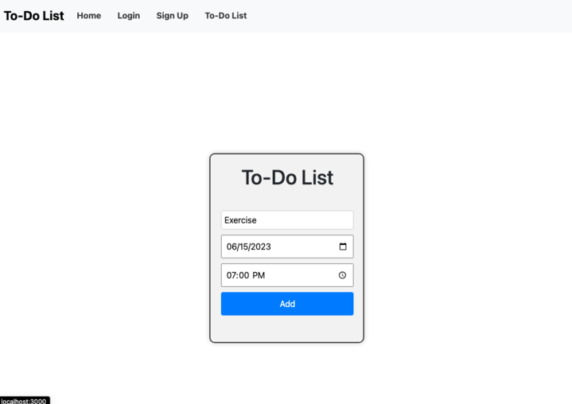
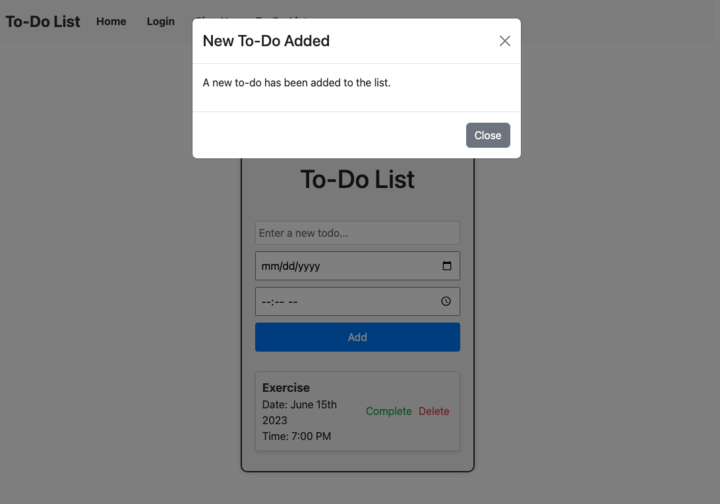

# To Do List
  
  

  ## Description:
  A friendly interactive to-do app that allows you to create tasks for the user to complete.

  ## Table of Contents 
  - [Installation](#installation)
  - [Usage](#usage)
  - [License](#license)
  - [Additional Info](#additional-info)

  ## Installation:
  Clone repository to local computer, run `npm install` in integrated terminal, then run `npm run develop` in integrated terminal.
  ## Usage:
  - App deployed to Heroku [here](https://to-do-application-650651e56723.herokuapp.com/)
  
  
  
  

  ## License
    This application is covered by the MIT license.

  ## Additional Info:
  - Github: [Brusomaroff](https://github.com/Brusomaroff), [eregaldo92](https://github.com/eregaldo92), [johnfitz3](https://github.com/johnfitz3), and [prestontravis](https://github.com/prestontravis)
   
